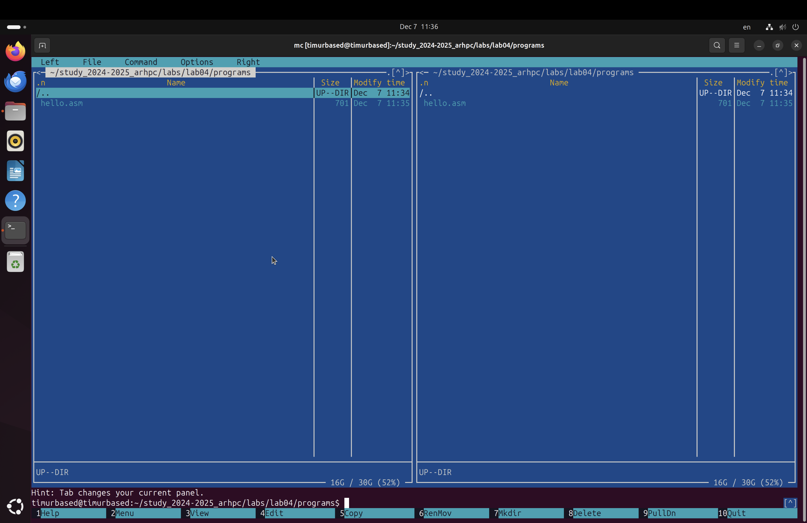
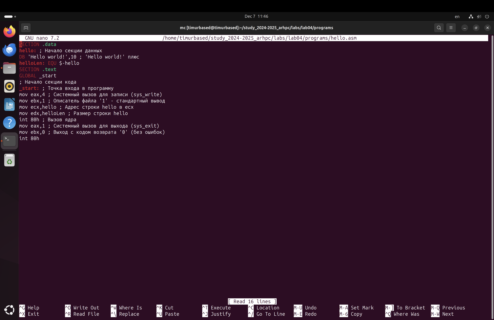
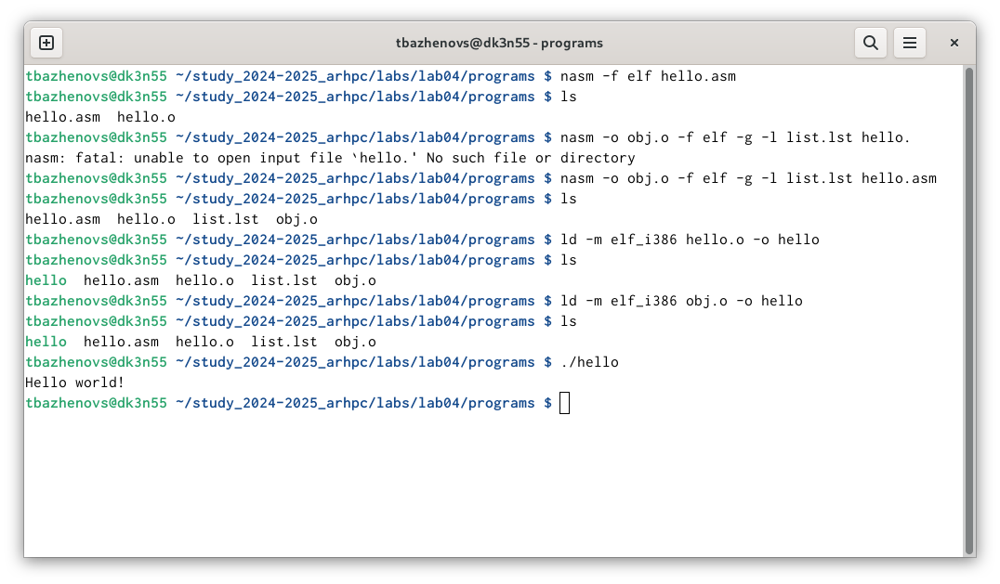
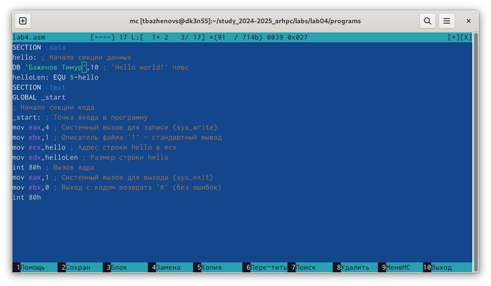
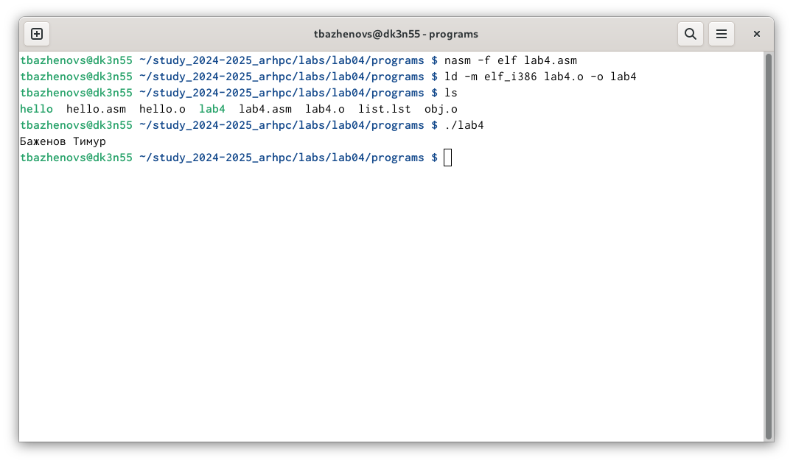

---
## Front matter
title: "Шаблон отчёта по лабораторной работе #4"
subtitle: "дисциплина: Архитектура компьютера"
author: "Баженов Тимур"

## Generic otions
lang: ru-RU
toc-title: "Содержание"

## Bibliography
bibliography: bib/cite.bib
csl: pandoc/csl/gost-r-7-0-5-2008-numeric.csl

## Pdf output format
toc: true # Table of contents
toc-depth: 2
lof: true # List of figures
lot: true # List of tables
fontsize: 12pt
linestretch: 1.5
papersize: a4
documentclass: scrreprt
## I18n polyglossia
polyglossia-lang:
  name: russian
  options:
	- spelling=modern
	- babelshorthands=true
polyglossia-otherlangs:
  name: english
## I18n babel
babel-lang: russian
babel-otherlangs: english
## Fonts
mainfont: IBM Plex Serif
romanfont: IBM Plex Serif
sansfont: IBM Plex Sans
monofont: IBM Plex Mono
mathfont: STIX Two Math
mainfontoptions: Ligatures=Common,Ligatures=TeX,Scale=0.94
romanfontoptions: Ligatures=Common,Ligatures=TeX,Scale=0.94
sansfontoptions: Ligatures=Common,Ligatures=TeX,Scale=MatchLowercase,Scale=0.94
monofontoptions: Scale=MatchLowercase,Scale=0.94,FakeStretch=0.9
mathfontoptions:
## Biblatex
biblatex: true
biblio-style: "gost-numeric"
biblatexoptions:
  - parentracker=true
  - backend=biber
  - hyperref=auto
  - language=auto
  - autolang=other*
  - citestyle=gost-numeric
## Pandoc-crossref LaTeX customization
figureTitle: "Рис."
tableTitle: "Таблица"
listingTitle: "Листинг"
lofTitle: "Список иллюстраций"
lotTitle: "Список таблиц"
lolTitle: "Листинги"
## Misc options
indent: true
header-includes:
  - \usepackage{indentfirst}
  - \usepackage{float} # keep figures where there are in the text
  - \floatplacement{figure}{H} # keep figures where there are in the text
---

# 1 Цель работы

Главной целью данной работы является приобретение навыков работы с языком
программирование ассемблер NASM.

# 2 Задание
1. Выполнение лабораторной работы
2. Редактирование
3. Работа с транслятором NASM, компоновка и запуск файла
4. Выполнение заданий для самостоятельной работы.

# 3 Теоретическое введение
Основными функциональными элементами любой ЭВМ являются центральный процессор, память и периферийные устройства. Взаимодействие этих устройств осуществляется через общую шину, к которой они подключены. Физически шина представляет собой большое количество проводников, соединяющих устройства друг с другом. В современных компьютерах проводники выполнены в виде электропроводящих дорожек на материнской плате. Основной задачей процессора является обработка информации, а также организация координации всех узлов компьютера. В состав центрального процессора входят следующие устройства: - арифметико-логическое устройство (АЛУ) — выполняет логические и арифметические действия, необходимые для обработки информации, хранящей ся в памят sи; - устройство управления (УУ) — обеспечивает управление и контроль всех устройств компьютера; - регистры — сверхбыстрая оперативная память небольшого объёма, входящая в состав процессора, для временного хранения промежуточных результатов выполнения инструкций; регистры процесс ора делятся на два типа: регистры общего назначения и специальные регистры. Для того, чтобы писать программы на ассемблере, необходимо знать, какие регистры процессора существуют и как их можно использовать. Большинство команд в программах написанных на ассемблере используют регистры в качеств е операндов. Практически все команды представляют собой преобразование данных хранящихся в регистрах процессора, это например пересылка данных между регистрами или между регистрами и памятью, преобразование (арифметические или логические 6 операции) данных хранящихся в регистрах. Доступ к регистрам осуществляется не по адресам, как к основной памяти, а по именам. Каждый регистр процессора архитектуры x86 имеет свое название, состоящее из 2 или 3 букв латинского алфавита. В качестве примера приведем названия основных регистров общего назначения (именно эти регистры чаще всего используются при написании программ): - RAX, RCX, RDX, RBX, RSI, R DI — 64-битные - EAX, ECX, EDX, EBX, ESI, EDI — 32-битные - AX, CX, D X, BX, SI, DI — 16-битные - AH, AL, CH, CL, DH, DL, BH, BL — 8-битные 6 Другим важным узлом ЭВМ является оперативное запоминающее устройство (ОЗУ). ОЗУ — это быстродействующее энергозависимое запоминающее устройст во, которое напрямую взаимодействует с узлами процессора, предназначенное для хранения программ и данных, с которыми процессор непосредственно работ ает в текущий момент. ОЗУ состоит из одинаковых пронумерованных ячеек пам яти. Номер ячейки памяти — это адрес хранящихся в ней данных. Периферийн ые устройства в составе ЭВМ: - устройства внешней памяти, которые предназна чены для долговременного хранения больших объёмов данных. - устройства ввода-вывода, которые обеспечивают взаимодействие ЦП с внешней средой. В основе вычислительного процесса ЭВМ лежит принцип программного управления. Это означает, что компьютер решает поставленную задачу как после довательность действий, записанных в виде программы. Коды команд представляют собой многоразрядные двоичные комбинации из 0 и 1. В коде машинной команды можно выделить две части: операционную и адресную. В операционной части хранится код команды, которую необходимо выполнить. В адресной части хранятся данные или адреса данных, которые участвуют в выполнении данной операции. При выполнении каждой команды процессор выполняет определённую последовательность стандартных действий, которая называется командным циклом процессора. Он заключается в следующем: 1. формирование адреса в памяти очередной команды; 2. считывание кода команды из памяти и её дешифрация; 3. выполнение команды; 4. переход к 7 следующей команде. Язык ассемблера (assembly language, сокращённо asm) — машинно-ориентированный язык низкого уровня. NASM — это открытый проект ассемблера, версии которого доступны под различные операционные системы и который позволяет получать объектные файлы для этих систем. В NASM используется Intel-синтаксис и поддерживаются инструкции x86-64.
# 4 Выполнение лабораторной работы

Создаем нужный каталог lab04/programs, и переходим в него

{#fig:fig1 width=70%}
С помощью команды touch, создаем файл hello.asm (рис. [-@fig:fig1])

# 4.2 Редактирование
{#fig:fig2 width=70%}
Далее с помощью Midnight commander открываем данный файл в режиме редактирования, и вставляем код для вывода Hello World (рис. [-@fig:fig2])

# 4.3 Работа с транслятором NASM, компоновка и запуск файла
{#fig:fig3 width=70%}
Превращаем текст программы для вывода “Hello world!” в объектный код с
помощью транслятора NASM, используя команду nasm -f elf hello.asm, ключ -f
указывает транслятору NASM, что требуется создать бинарный файл в формате ELF.
Далее Передаю объектный файл hello.o на обработку компоновщику LD, чтобы
получить исполняемый файл hello (рис. [-@fig:fig3]).
А далее с помощью команды ./hello, запускаем файл и получаем результат.(рис. [-@fig:fig3])

# 4.4 Выполнение заданий для самостоятельной работы.

{#fig:fig4 width=70%}
Копируем исходный файл и меняем его название на lab4.asm.
После чего, в 3-й строке, вместо "Hello World" вписываю свои фамилию и имя.(рис. [-@fig:fig4])

{#fig:fig5 width=70%}
Сохраняем, и превращаем текст программы в обьектный файл с помощью транслятора NASM.
Далее производим компоновку, запускаем и проверяем результат.(рис. [-@fig:fig5])

# Выводы

Данная лабораторная работа помогла освоить принцип компоновки, а также принцип работы языка программирования Assembly NASM.

# Список литературы

::: {#refs}
:::
