---
## Front matter
title: "Отчет по лабораторной работе #6"
subtitle: "Простейший вариант"
author: "Баженов Тимур"

## Generic otions
lang: ru-RU
toc-title: "Содержание"

## Bibliography
bibliography: bib/cite.bib
csl: pandoc/csl/gost-r-7-0-5-2008-numeric.csl

## Pdf output format
toc: true # Table of contents
toc-depth: 2
lof: true # List of figures
lot: true # List of tables
fontsize: 12pt
linestretch: 1.5
papersize: a4
documentclass: scrreprt
## I18n polyglossia
polyglossia-lang:
  name: russian
  options:
	- spelling=modern
	- babelshorthands=true
polyglossia-otherlangs:
  name: english
## I18n babel
babel-lang: russian
babel-otherlangs: english
## Fonts
mainfont: IBM Plex Serif
romanfont: IBM Plex Serif
sansfont: IBM Plex Sans
monofont: IBM Plex Mono
mathfont: STIX Two Math
mainfontoptions: Ligatures=Common,Ligatures=TeX,Scale=0.94
romanfontoptions: Ligatures=Common,Ligatures=TeX,Scale=0.94
sansfontoptions: Ligatures=Common,Ligatures=TeX,Scale=MatchLowercase,Scale=0.94
monofontoptions: Scale=MatchLowercase,Scale=0.94,FakeStretch=0.9
mathfontoptions:
## Biblatex
biblatex: true
biblio-style: "gost-numeric"
biblatexoptions:
  - parentracker=true
  - backend=biber
  - hyperref=auto
  - language=auto
  - autolang=other*
  - citestyle=gost-numeric
## Pandoc-crossref LaTeX customization
figureTitle: "Рис."
tableTitle: "Таблица"
listingTitle: "Листинг"
lofTitle: "Список иллюстраций"
lotTitle: "Список таблиц"
lolTitle: "Листинги"
## Misc options
indent: true
header-includes:
  - \usepackage{indentfirst}
  - \usepackage{float} # keep figures where there are in the text
  - \floatplacement{figure}{H} # keep figures where there are in the text
---

# Цель работы

Цель данной лабораторной работы - освоение арифметческих инструкций языка ассемблера NASM.

# Задание

1. Символьные и численные данные в NASM
2. Выполнение арифметических операций в NASM
3. Выполнение заданий для самостоятельной работы

# Теоретическое введение

Большинство инструкций на языке ассемблера требуют обработки операндов. Адрес операнда предоставляет место, где хранятся данные, подлежащие обработке. Это могут быть данные хранящиеся в регистре или в ячейке памяти. 
- Регистровая адресация – операнды хранятся в регистрах и в команде используются имена этих регистров, например: mov ax,bx.
- Непосредственная адресация – значение операнда задается непосредственно в команде, Например: mov ax,2.
- Адресация памяти – операнд задает адрес в памяти. В команде указывается символическое обозначение ячейки памяти, над содержимым которой требуется выполнить операцию.

Ввод информации с клавиатуры и вывод её на экран осуществляется в символьном виде. Кодирование этой информации производится согласно кодовой таблице символов ASCII. ASCII – сокращение от American Standard Code for Information Interchange (Американский стандартный код для обмена информацией). Согласно стандарту ASCII каждый символ кодируется одним байтом.
Среди инструкций NASM нет такой, которая выводит числа (не в символьном виде). Поэтому, например, чтобы вывести число, надо предварительно преобразовать его цифры в ASCII-коды этих цифр и выводить на экран эти коды, а не само число. Если же выводить число на экран непосредственно, то экран воспримет его не как число, а как последовательность ASCII-символов – каждый байт числа будет воспринят как один ASCII-символ – и выведет на экран эти символы.
Аналогичная ситуация происходит и при вводе данных с клавиатуры. Введенные данные будут представлять собой символы, что сделает невозможным получение корректного результата при выполнении над ними арифметических операций.
Для решения этой проблемы необходимо проводить преобразование ASCII символов в числа и обратно.

# Выполнение лабораторной работы

Описываются проведённые действия, в качестве иллюстрации даётся ссылка на иллюстрацию (рис. [-@fig:001]).
Создаю каталог и файл lab6_1.asm
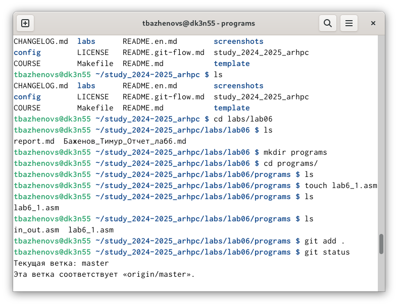{#fig:001 width=70%}

Открываем его в режиме редактирования и вставляем туда код.
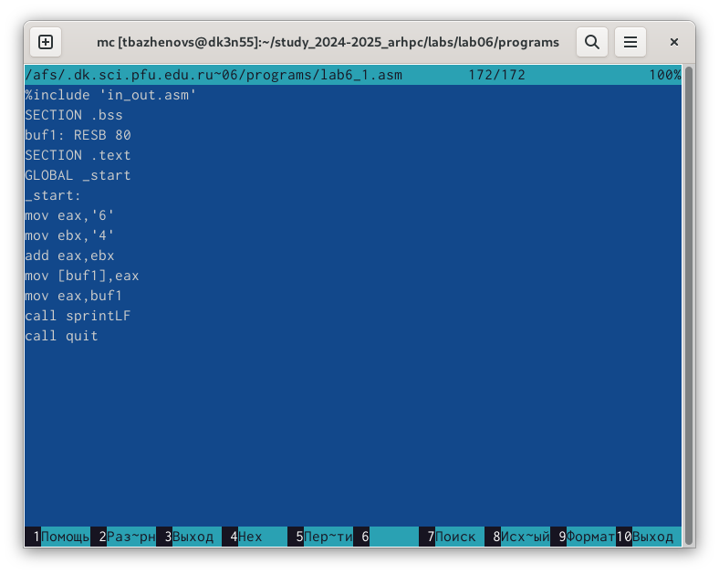{#fig:001 width=70%}

Запускаем файл. Видим символ j, потому что программа вывела то, что соответствует по системе ASCII сумме двоичных кодов символов 4 и 6
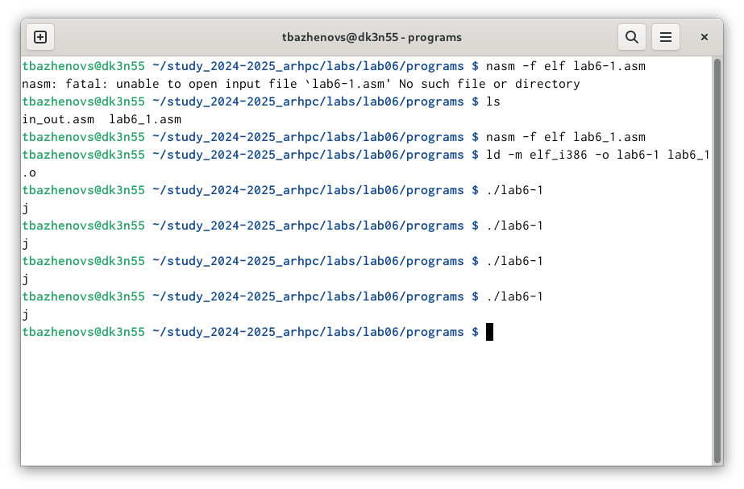{#fig:001 width=70%}

Изменяю в программе символы "6" и "4" на 6 и 4.
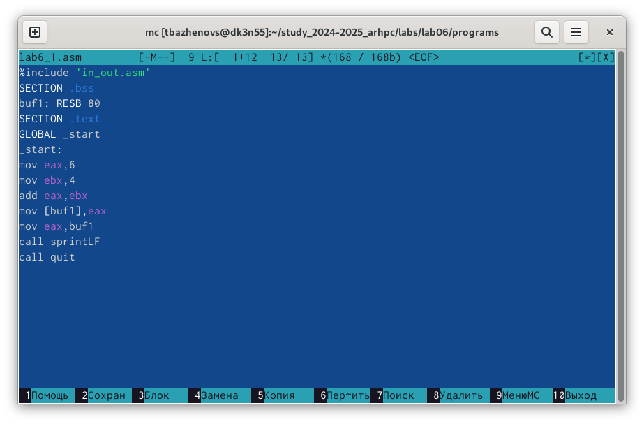{#fig:001 width=70%}

Выполняем запуск программы и замечаем, что вывелся символ с кодом 10, это символ перевода строки, а данный символ не отображается при выводе на экран.
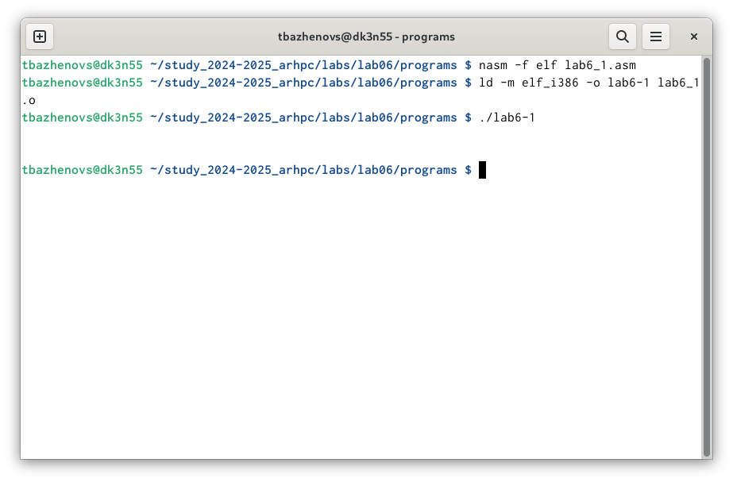{#fig:001 width=70%}


Создаю файл lab6-2.asm и вставляю в него код из ТУИС.
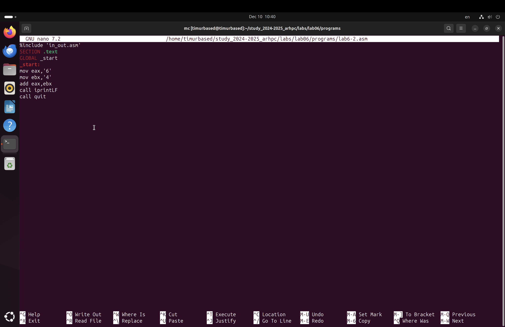{#fig:001 width=70%}

Запускаем файл, и получаем результат 106.
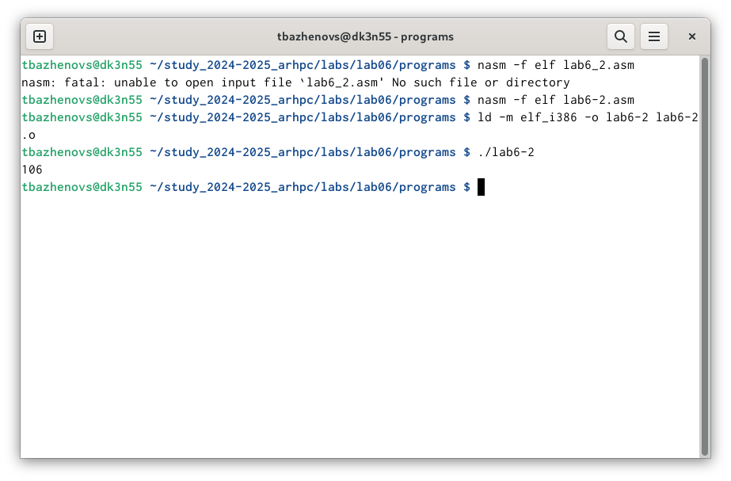{#fig:001 width=70%}

Изменяю в программе символы "6" и "4" на 6 и 4.
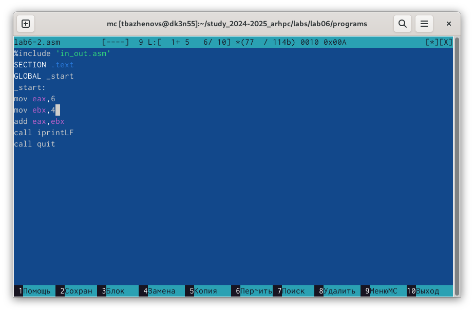{#fig:001 width=70%}

Запускаем файл, и получаем результат 10, это сумма 6 и 4.
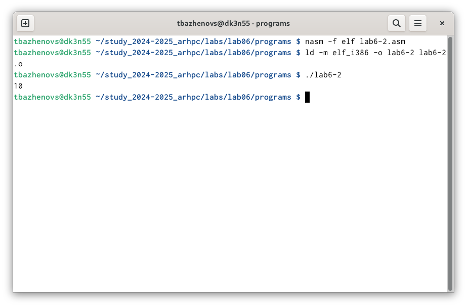{#fig:001 width=70%}

Если в выводе поменять функции printLF на iprint, то текст не выведится с новой строки.

# Выполнение арифметических операций в NASM

Создаем файл lab6-3.asm.
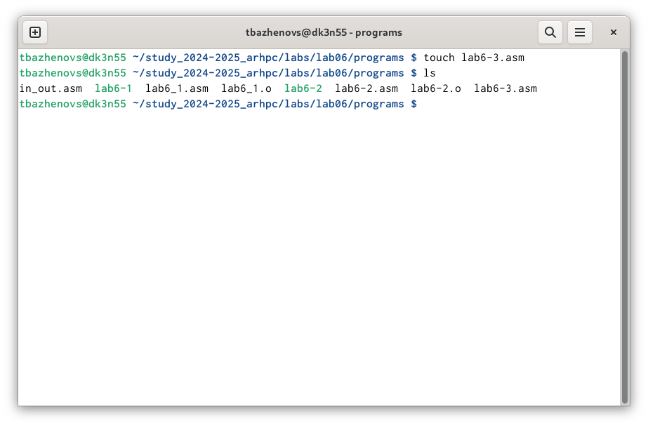{#fig:001 width=70%}

Вставляем туда код и ТУИС.
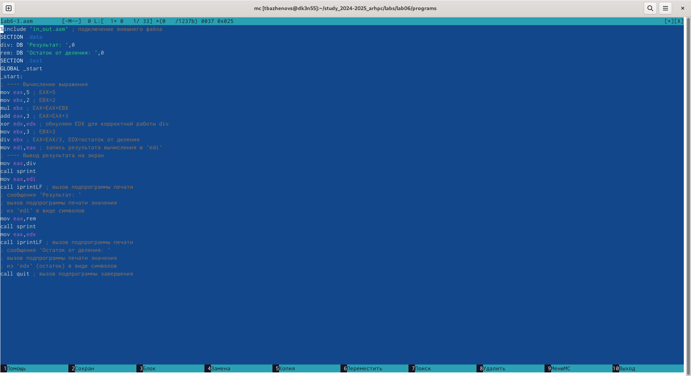{#fig:001 width=70%}


Компонуем и запускаем. Получаем 4, и остаток 1.
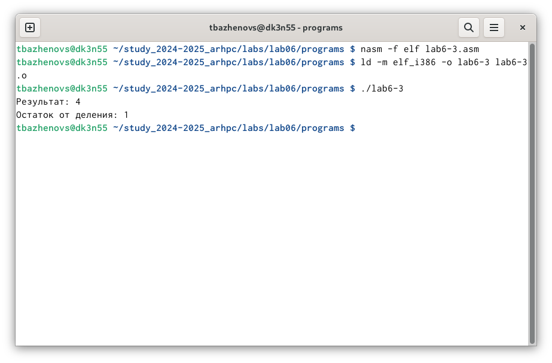{#fig:001 width=70%}


Изменяем текст программы для вычисления выражения f = (4*6+2)/5
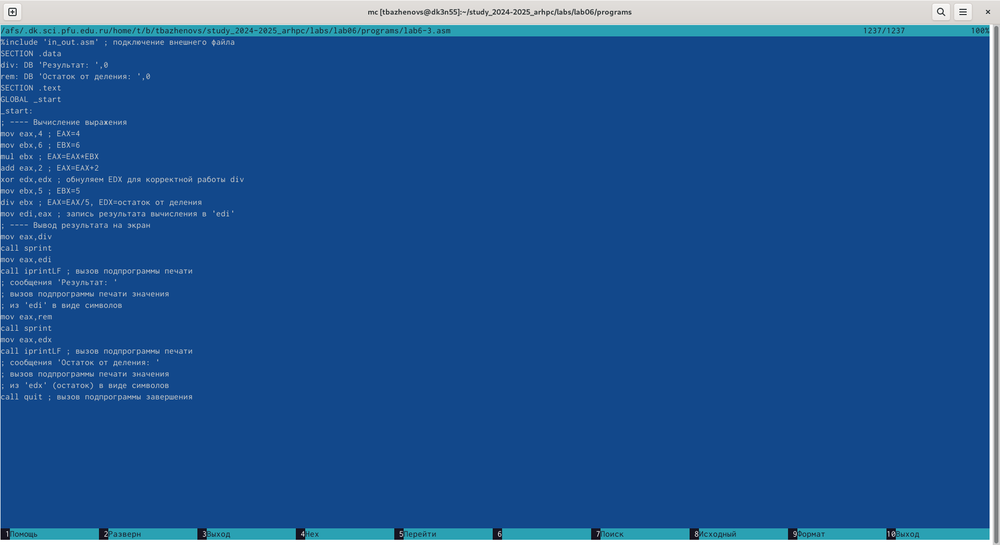{#fig:001 width=70%}

Компонуем и проверяем.
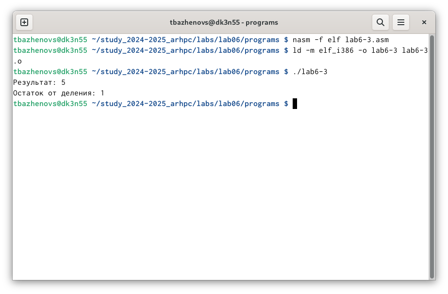{#fig:001 width=70%}

Создаем файл variant и вставляем туда код.
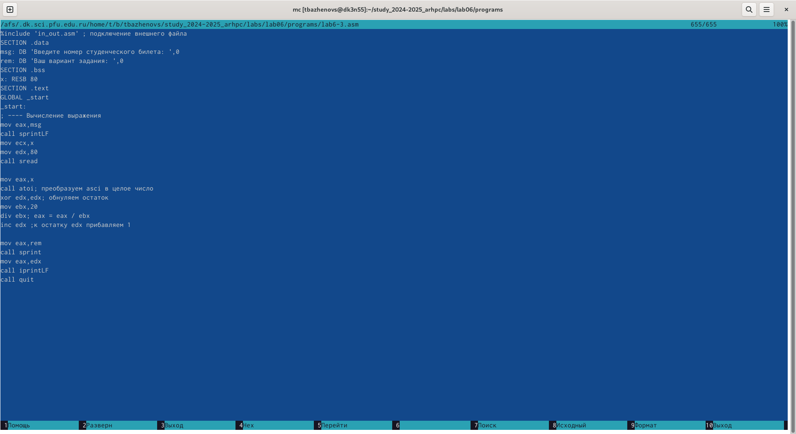{#fig:001 width=70%}

Запускаем и проверяем результат.
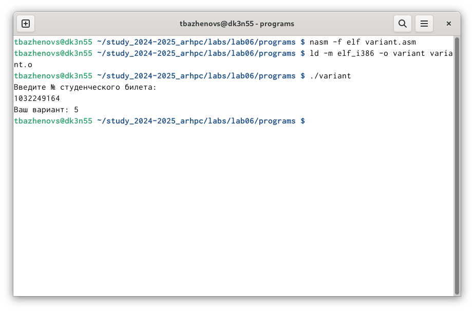{#fig:001 width=70%}

# Ответы на вопросы

1. За вывод сообщения "Ваш вариант" отвечает строка:
```NASM
mov eax,rem
call sprint
```

2. Инструкция mov ecx, x используется, чтобы положить адрес вводимой строки x в регистр ecx. mov edx, 80 - запись в регистр edx длины вводимой строки. call sread - вызов подпрограммы из внешнего файла, обеспечивающей ввод сообщения с клавиатуры.

3. call atoi используется для вызова подпрограммы из внешнего файла, которая преобразует ascii-код символа в целое число и записывает результат в регистр eax.

4. За вычислени варианта, отвечают строки 
```NASM
mov ebx,20
div ebx; eax = eax / ebx
inc edx ;к остатку edx прибавляем 1
```

5. В регистр EDX.

6. Инструкция INC отвечает за инкремирование значения переменных на 1.

7. За вывод на экран, отвечают строки:
```NASM
mov eax,edx
call iprintLF
```

# Задание для самостоятельной работы

Создаем файл final.asm.
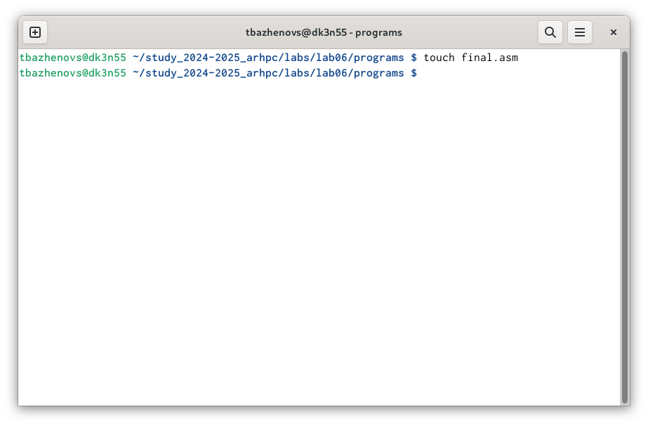{#fig:001 width=70%}

Далее пишу код для выполнения индивидуального задания.
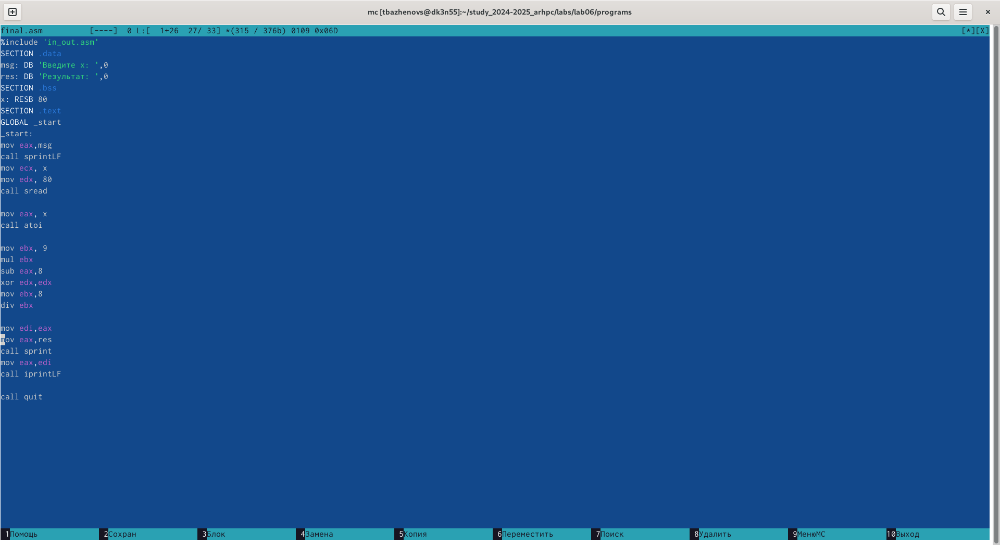{#fig:001 width=70%}

Выполняем запуск программы
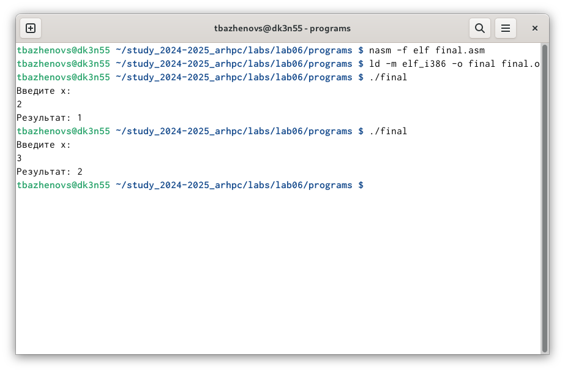{#fig:001 width=70%}

# Выводы

При выполнении данной работы мы познакомились с арифметическими операциями в языке программирования Assembly NASM.

# Список литературы{.unnumbered}

https://esystem.rudn.ru/pluginfile.php/2089086/mod_resource/content/0/Лабораторная%20работа%20№6.%20Арифметические%20операции%20в%20NASM..pdf

::: {#refs}
:::
