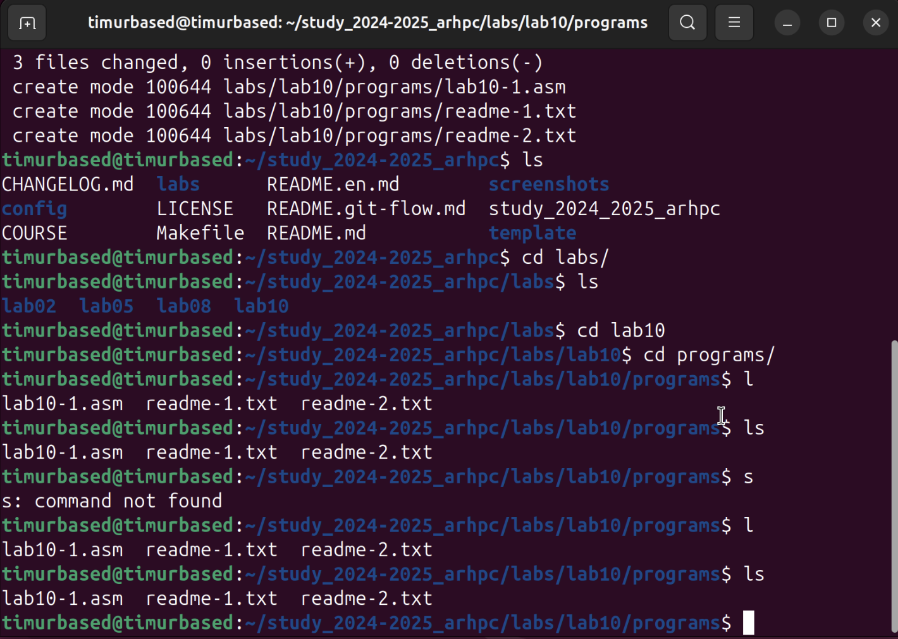
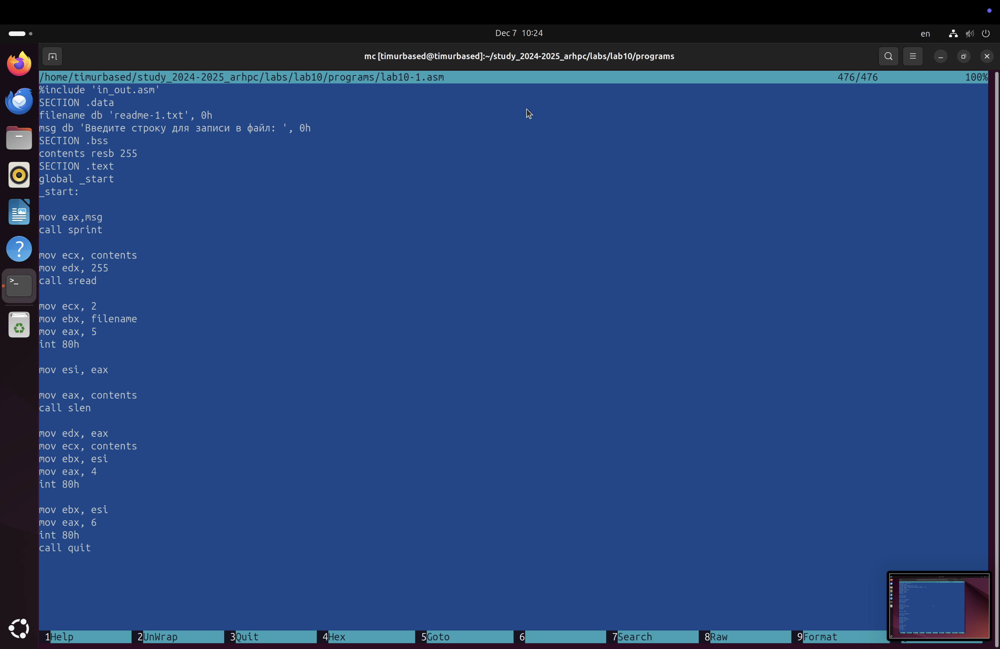
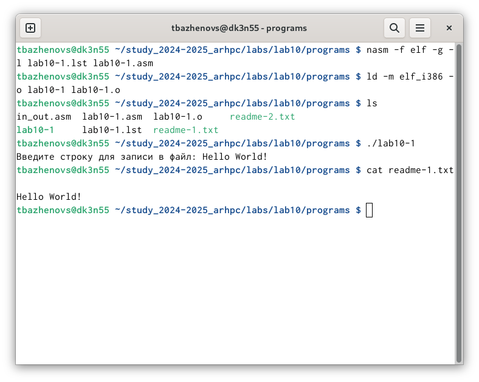
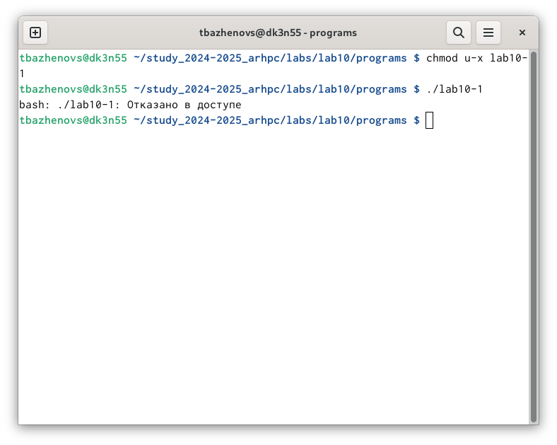
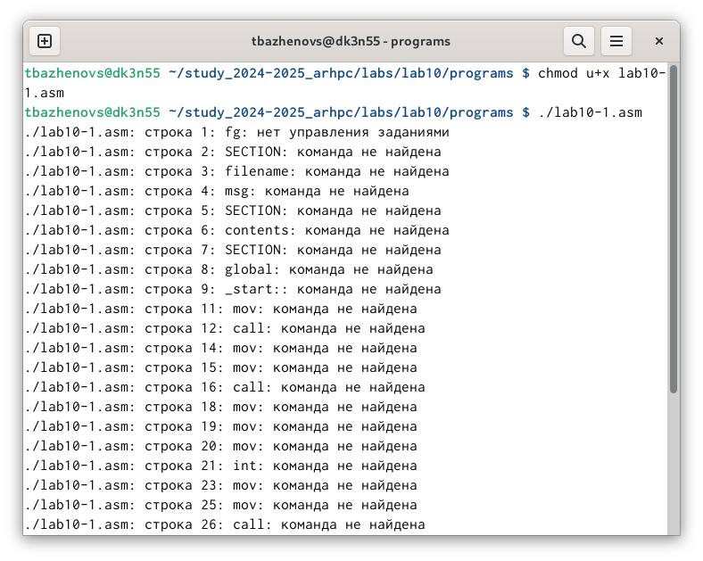
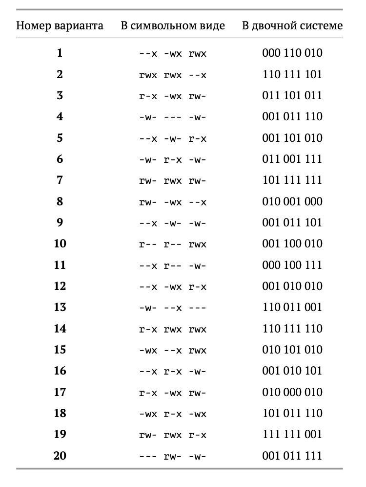
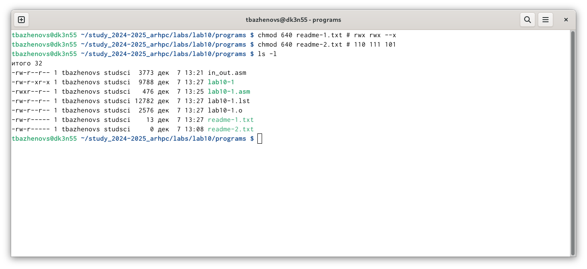
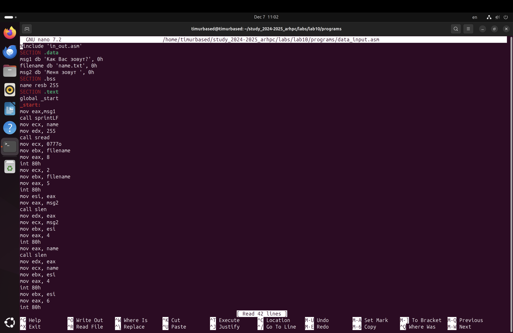
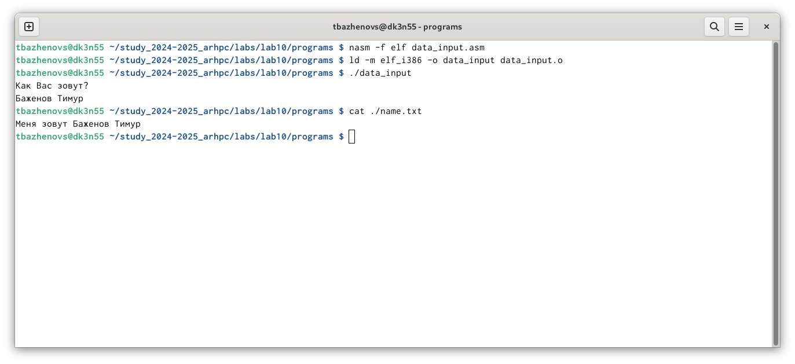

---
## Front matter
title: "Отчёт по Лабораторной Работе №10"
subtitle: "Дисциплина: Архитектура компьютера"
author: "Баженов Тимур"

## Generic otions
lang: ru-RU
toc-title: "Содержание"

## Bibliography
bibliography: bib/cite.bib
csl: pandoc/csl/gost-r-7-0-5-2008-numeric.csl

## Pdf output format
toc: true # Table of contents
toc-depth: 2
lof: true # List of figures
lot: true # List of tables
fontsize: 12pt
linestretch: 1.5
papersize: a4
documentclass: scrreprt
## I18n polyglossia
polyglossia-lang:
  name: russian
  options:
	- spelling=modern
	- babelshorthands=true
polyglossia-otherlangs:
  name: english
## I18n babel
babel-lang: russian
babel-otherlangs: english
## Fonts
mainfont: IBM Plex Serif
romanfont: IBM Plex Serif
sansfont: IBM Plex Sans
monofont: IBM Plex Mono
mathfont: STIX Two Math
mainfontoptions: Ligatures=Common,Ligatures=TeX,Scale=0.94
romanfontoptions: Ligatures=Common,Ligatures=TeX,Scale=0.94
sansfontoptions: Ligatures=Common,Ligatures=TeX,Scale=MatchLowercase,Scale=0.94
monofontoptions: Scale=MatchLowercase,Scale=0.94,FakeStretch=0.9
mathfontoptions:
## Biblatex
biblatex: true
biblio-style: "gost-numeric"
biblatexoptions:
  - parentracker=true
  - backend=biber
  - hyperref=auto
  - language=auto
  - autolang=other*
  - citestyle=gost-numeric
## Pandoc-crossref LaTeX customization
figureTitle: "Рис."
tableTitle: "Таблица"
listingTitle: "Листинг"
lofTitle: "Список иллюстраций"
lotTitle: "Список таблиц"
lolTitle: "Листинги"
## Misc options
indent: true
header-includes:
  - \usepackage{indentfirst}
  - \usepackage{float} # keep figures where there are in the text
  - \floatplacement{figure}{H} # keep figures where there are in the text
---

# Цель работы

Научиться писать программы для работы с файлами.

# Задание

1. Написание программ для работы с файлами.
2. Задание для самостоятельной работы.

# Теоретическое введение

Права доступа определяют набор действий (чтение, запись, выполнение), разрешённых
для выполнения пользователям системы над файлами. Для каждого файла пользователь
может входить в одну из трех групп: владелец, член группы владельца, все остальные. Для
каждой из этих групп может быть установлен свой набор прав доступа.

Для изменения прав доступа служит команда chmod, которая понимает как символьное, так и числовое указание прав.

Обработка файлов в операционной системе Linux осуществляется за счет использования
определенных системных вызовов. Для корректной работы и доступа к файлу при его открытии или создании, файлу присваивается уникальный номер (16-битное целое число) –
дескриптор файла.

Для создания и открытия файла служит системный вызов sys_creat, который использует
следующие аргументы: права доступа к файлу в регистре ECX, имя файла в EBX и номер
системного вызова sys_creat (8) в EAX.

Для открытия существующего файла служит системный вызов sys_open, который использует следующие аргументы: права доступа к файлу в регистре EDX, режим доступа к файлу в
регистр ECX, имя файла в EBX и номер системного вызова sys_open (5) в EAX.

Для записи в файл служит системный вызов sys_write, который использует следующие
аргументы: количество байтов для записи в регистре EDX, строку содержимого для записи
ECX, файловый дескриптор в EBX и номер системного вызова sys_write (4) в EAX.
Системный вызов возвращает фактическое количество записанных байтов в регистр EAX.
В случае ошибки, код ошибки также будет находиться в регистре EAX.
Прежде чем записывать в файл, его необходимо создать или открыть, что позволит получить дескриптор файла.

Для чтения данных из файла служит системный вызов sys_read, который использует
следующие аргументы: количество байтов для чтения в регистре EDX, адрес в памяти для
записи прочитанных данных в ECX, файловый дескриптор в EBX и номер системного вызова
sys_read (3) в EAX. Как и для записи, прежде чем читать из файла, его необходимо открыть,
что позволит получить дескриптор файла.

Для правильного закрытия файла служит системный вызов sys_close, который использует
один аргумент – дескриптор файла в регистре EBX. После вызова ядра происходит удаление
дескриптора файла, а в случае ошибки, системный вызов возвращает код ошибки в регистр
EAX.

Для изменения содержимого файла служит системный вызов sys_lseek, который использует следующие аргументы: исходная позиция для смещения EDX, значение смещения в
байтах в ECX, файловый дескриптор в EBX и номер системного вызова sys_lseek (19) в EAX.
Значение смещения можно задавать в байтах.

Удаление файла осуществляется системным вызовом sys_unlink, который использует
один аргумент – имя файла в регистре EBX.

# Выполнение лабораторной работы

Создаю каталог lab10/programs, далее создаю в нем 3 файла: readme-1.txt, readme-2.txt и lab10-1.asm(файлы уже созданы).

{#fig:001 width=70%}

Вписываем в файл программу из листинга 10.1.
{#fig:001 width=70%}

Проверяем работу программы.
{#fig:001 width=70%}

Далее с помощью chmod u-x меняем права доступа к файлу, а именно запретив его выполнение.
И пробуем запустить файл.
{#fig:001 width=70%}

Файл не запускается, так как мы забрали у владельца доступ на исполнение файла: "u" - это владелец, "-" - забираем право, "x" - право которое мы забираем, в нашем случае это право на исполнение. 

С помощью команды chmod u+х изменяем права доступа к файлу lab10-1.asm с исходным текстом программы, добавив права на исполнение, и пытаемся выполнить его.
{#fig:001 width=70%}
Текстовый файл начинает исполнение, но не исполняется, т.к не содержит в себе команд для терминала.

Находим свой вариант (№ 2) и выполняем задание.
{#fig:001 width=70%}

Проверяем правильность выполнения с помощью команды ls -l.
{#fig:001 width=70%}

# Задание для самостоятельной работы
Пишем код программы, выводящей приглашения “Как Вас зовут?”, считывающей с клавиатуры фамилию и имя и создающую файл, в который записывается сообщение “Меня зовут "Фамилия Имя""

{#fig:001 width=70%}

Запускаем программу и проверяем его работу.

{#fig:001 width=70%}
# Выводы

Мы научились писать программы на Assembly NASM, создавать файлы, и менять к ним доступ.

# Список литературы{.unnumbered}

https://esystem.rudn.ru/pluginfile.php/2089097/mod_resource/content/0/Лабораторная%20работа%20№10.%20Работа%20с%20файлами%20средствами%20Nasm.pdf

::: {#refs}
:::
